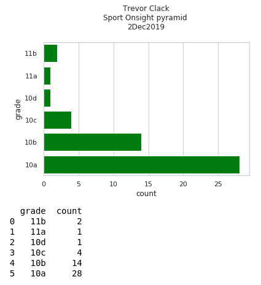
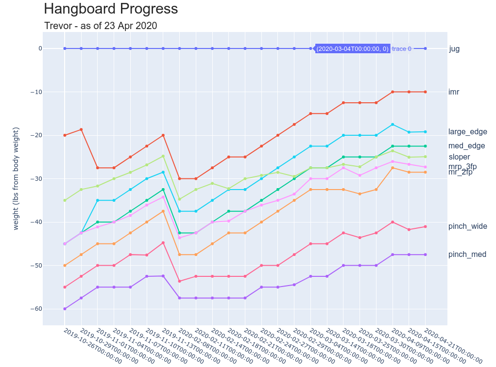

# `gpsgrabber.py`

Non-standard python libraries and Linux utilities needed:

        BeautifulSoup   -       pip3 install python3-bs4
        gpsbabel        -       sudo apt install gpsbabel


## Purpose:
Provide an automated, no-effort service to scrape GPS coordinates for all walls in a climbing location from Mountain Project. Read the [blog writeup](https://tclack88.github.io/blog/code/2019/10/12/mountain-project-GPS.html) for more code detail

## How to Use:
0. If you don't already have an account, make one at [mountain project](mountainproject.com). Go to the area you're interested in and get that URL as well
1. visit their [API](mountainproject.com/data) and copy your unique API key
2. Download and open `gpsgrabber.py`
3. Paste your API key there and change the default UL to whichever area you're interested in
4. You'll be prompted to name the file (spaces will be replaced with underscores), just plug in your GPS device and drag and drop the newly created .gpx file there


<hr>

# `csv_scraping.ipynb`


Non-standard python libraries needed:

        BeautifulSoup   -       pip3 install python3-bs4


The purpose of this notebook is to gather a collection of random users on mountain project into a dataframe for analysis. This collection is seeded from a bunch of names. As is, the most popular baby names (1op 100 male and female) from 1985 act as the seeds, but a list can do well. To use this yourself, either set "possible\_users" equal to a list of names you want, or change the date and page number in the cell:
```python

# Grab names to seed the search (most popular male and female names from 1985)
name_url = "https://www.weddingvendors.com/baby-names/popular/1985/?page=1" # vary page number for more samples, I collected up to 6 for the data in my github

source = requests.get(name_url).text
soup = BeautifulSoup(source,'html.parser')
names = soup.find_all('td', class_='n')
possible_users = []
for name in names:
  possible_user = name.text
  possible_users.append(possible_user)
```

The csv files labeled "climber\_data" 1-6 represent my data scrapes, each took about an hour to gather, so thumbrule: 200 names/hour

The features I've engineered are ok, I'm sure there are more

<hr>

# `mproj_analysis.ipynb`

This represents the analysis part I've done on the above collected data, see the data better presented [on my blog](https://tclack88.github.io/blog/personal/2019/09/27/climber-analysis.html)

<hr>

# `rp_os_pyramids.ipynb`

This notebook is used for self-assessment of pyramids for redpoint and onsight climbs for trad and sport climbs. Ideally, when you go from your hardest climbed grade to the next hardest, you should have done twice as many. Same goes from the 2nd to the 3rd highest. These numbers don't have to be exact, but it's a good rule of thumb. As an example:
If you climb 13b (congrats btw) your top 5 grade breakdown should be something like:
- 1 x 13b
- 2 x 13a
- 4 x 12d
- 8 x 12c
- 9 x 12b

Here's an example of the output of this notebook



# `hangboard_progress.ipynb`

A notebook to track progress of hangboard sessions. Plots are displayed as an interactive plotly chart. Vertical axis is weight, horizontal axis is date. A penalty is applied for failed attempts so the Vertical axis is adjusted accordingly. (subtract 2.5 lbs x log6(failed attempts) and 2.5 lbs x fraction of the total set time failed) These are arbitrary choices but they encourage progressive overload without punishing failure excessively which lends itself well to motivation


